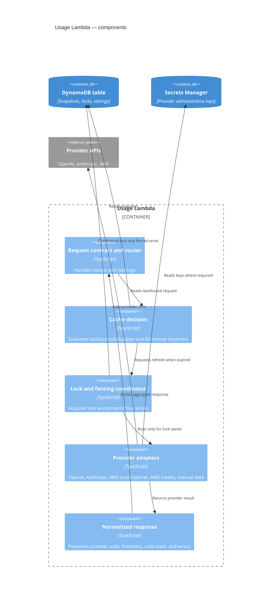

# C4 Component View — Backend

```mermaid
C4Component
    title Usage Lambda — components
    Container_Boundary(lambda, "Usage Lambda") {
        Component(router, "Request contract and router", "TypeScript", "Handles /usage and /settings")
        Component(cache, "Cache decision", "TypeScript", "Evaluates lastSuccessfulUpdate and 60-minute freshness")
        Component(lock, "Lock and fencing coordinator", "TypeScript", "Acquires lock and protects final writes")
        Component(adapters, "Provider adapters", "TypeScript", "OpenAI, Anthropic, AWS Cost Explorer, AWS credits, manual data")
        Component(normalizer, "Normalized response", "TypeScript", "Preserves provider units, freshness, stale state, and errors")
    }
    ContainerDb(dynamo, "DynamoDB table", "Snapshots, locks, settings")
    ContainerDb(secrets, "Secrets Manager", "Provider administrative keys")
    System_Ext(apis, "Provider APIs", "OpenAI, Anthropic, AWS")
    Rel(router, cache, "Reads dashboard request")
    Rel(cache, dynamo, "Reads snapshot")
    Rel(cache, lock, "Requests refresh when expired")
    Rel(lock, dynamo, "Conditional lock and fenced write")
    Rel(lock, adapters, "Runs only for lock owner")
    Rel(adapters, secrets, "Reads keys where required")
    Rel(adapters, apis, "Calls provider APIs")
    Rel(adapters, normalizer, "Returns provider result")
    Rel(normalizer, router, "Builds aggregate response")
```

The component names describe the responsibilities established by the source document; they do not imply implementation beyond the MVP decisions.
