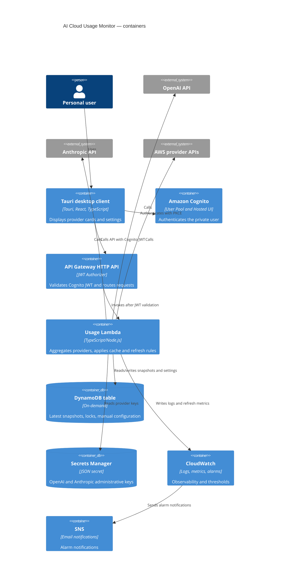

# C4 Container View

```mermaid
C4Container
    title AI Cloud Usage Monitor — containers
    Person(user, "Personal user")
    System_Ext(openai, "OpenAI API")
    System_Ext(anthropic, "Anthropic API")
    System_Ext(aws, "AWS provider APIs")
    Container(tauri, "Tauri desktop client", "Tauri, React, TypeScript", "Displays provider cards and settings")
    Container(cognito, "Amazon Cognito", "User Pool and Hosted UI", "Authenticates the private user")
    Container(api, "API Gateway HTTP API", "JWT Authorizer", "Validates Cognito JWT and routes requests")
    Container(lambda, "Usage Lambda", "TypeScript/Node.js", "Aggregates providers, applies cache and refresh rules")
    ContainerDb(dynamo, "DynamoDB table", "On-demand", "Latest snapshots, locks, manual configuration")
    ContainerDb(secrets, "Secrets Manager", "JSON secret", "OpenAI and Anthropic administrative keys")
    Container(cloudwatch, "CloudWatch", "Logs, metrics, alarms", "Observability and thresholds")
    Container(sns, "SNS", "Email notifications", "Alarm notifications")
    Rel(user, tauri, "Uses")
    Rel(tauri, cognito, "Authenticates with PKCE")
    Rel(tauri, api, "Calls API with Cognito JWT")
    Rel(api, lambda, "Invokes after JWT validation")
    Rel(lambda, dynamo, "Reads/writes snapshots and settings")
    Rel(lambda, secrets, "Reads provider keys")
    Rel(lambda, openai, "Calls")
    Rel(lambda, anthropic, "Calls")
    Rel(lambda, aws, "Calls")
    Rel(lambda, cloudwatch, "Writes logs and refresh metrics")
    Rel(cloudwatch, sns, "Sends alarm notifications")
```
