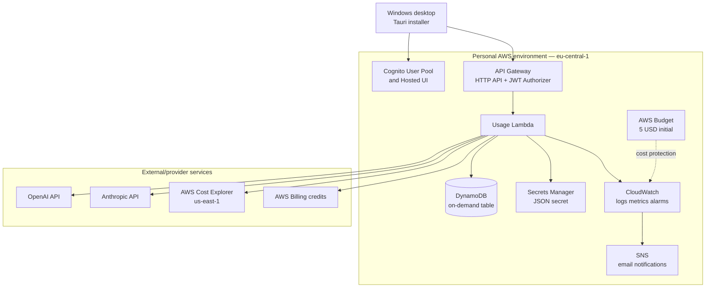

# C4 Deployment View

```mermaid
flowchart TB
    desktop[Windows desktop\nTauri installer]
    subgraph awsEu[Personal AWS environment — eu-central-1]
        cognito[Cognito User Pool\nand Hosted UI]
        api[API Gateway\nHTTP API + JWT Authorizer]
        lambda[Usage Lambda]
        ddb[(DynamoDB\non-demand table)]
        secrets[Secrets Manager\nJSON secret]
        cw[CloudWatch\nlogs metrics alarms]
        sns[SNS\nemail notifications]
        budget[AWS Budget\n5 USD initial]
    end
    subgraph external[External/provider services]
        openai[OpenAI API]
        anthropic[Anthropic API]
        cost[AWS Cost Explorer\nus-east-1]
        credits[AWS Billing credits]
    end
    desktop --> cognito
    desktop --> api
    api --> lambda
    lambda --> ddb
    lambda --> secrets
    lambda --> cw
    cw --> sns
    lambda --> openai
    lambda --> anthropic
    lambda --> cost
    lambda --> credits
    budget -. cost protection .-> cw
```

No deployment, bootstrap, or AWS operation is performed by this documentation task.
