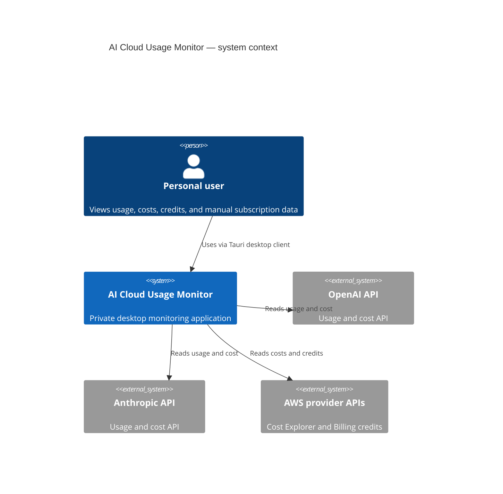

# C4 System Context

```mermaid
C4Context
    title AI Cloud Usage Monitor — system context
    Person(user, "Personal user", "Views usage, costs, credits, and manual subscription data")
    System(monitor, "AI Cloud Usage Monitor", "Private desktop monitoring application")
    System_Ext(openai, "OpenAI API", "Usage and cost API")
    System_Ext(anthropic, "Anthropic API", "Usage and cost API")
    System_Ext(aws, "AWS provider APIs", "Cost Explorer and Billing credits")
    Rel(user, monitor, "Uses via Tauri desktop client")
    Rel(monitor, openai, "Reads usage and cost")
    Rel(monitor, anthropic, "Reads usage and cost")
    Rel(monitor, aws, "Reads costs and credits")
```

The system is a single-user personal application. ChatGPT and Claude subscription values are entered manually; their web pages are not accessed.
