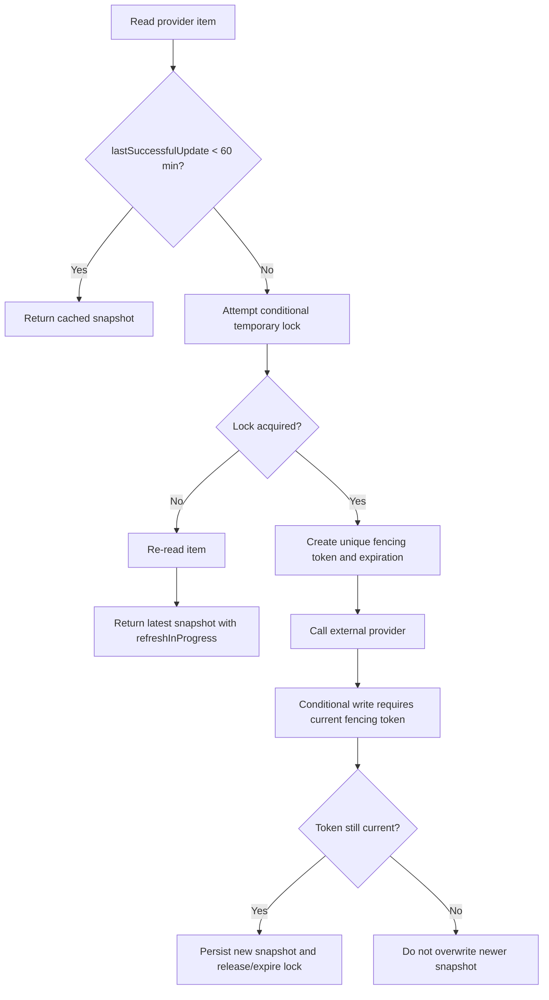

# Cache, lock, and fencing flow

```mermaid
flowchart TD
    A[Read provider item] --> B{lastSuccessfulUpdate < 60 min?}
    B -- Yes --> C[Return cached snapshot]
    B -- No --> D[Attempt conditional temporary lock]
    D --> E{Lock acquired?}
    E -- No --> F[Re-read item]
    F --> G[Return latest snapshot with refreshInProgress]
    E -- Yes --> H[Create unique fencing token and expiration]
    H --> I[Call external provider]
    I --> J[Conditional write requires current fencing token]
    J --> K{Token still current?}
    K -- Yes --> L[Persist new snapshot and release/expire lock]
    K -- No --> M[Do not overwrite newer snapshot]
```

The lock prevents duplicate concurrent provider calls. The fencing condition prevents an invocation whose lock expired from overwriting a newer result.
