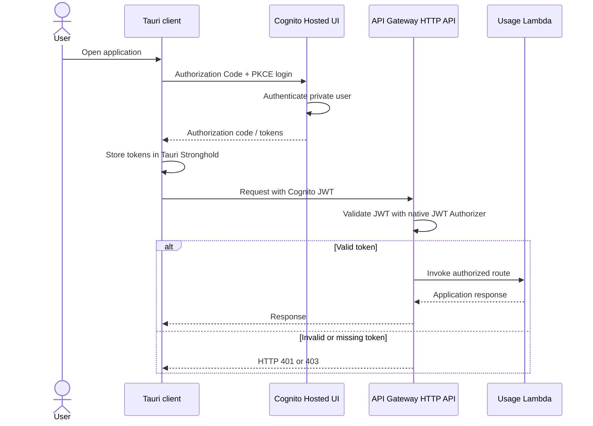

# Cognito authentication flow

```mermaid
sequenceDiagram
    actor User
    participant Tauri as Tauri client
    participant Cognito as Cognito Hosted UI
    participant API as API Gateway HTTP API
    participant Lambda as Usage Lambda
    User->>Tauri: Open application
    Tauri->>Cognito: Authorization Code + PKCE login
    Cognito->>Cognito: Authenticate private user
    Cognito-->>Tauri: Authorization code / tokens
    Tauri->>Tauri: Store tokens in Tauri Stronghold
    Tauri->>API: Request with Cognito JWT
    API->>API: Validate JWT with native JWT Authorizer
    alt Valid token
        API->>Lambda: Invoke authorized route
        Lambda-->>API: Application response
        API-->>Tauri: Response
    else Invalid or missing token
        API-->>Tauri: HTTP 401 or 403
    end
```
