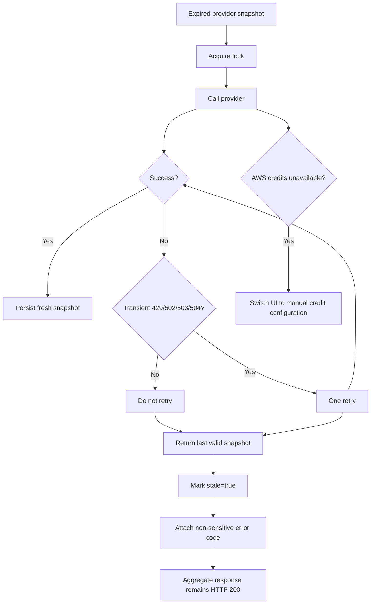

# Provider error and fallback flow

```mermaid
flowchart TD
    A[Expired provider snapshot] --> B[Acquire lock]
    B --> C[Call provider]
    C --> D{Success?}
    D -- Yes --> E[Persist fresh snapshot]
    D -- No --> F{Transient 429/502/503/504?}
    F -- Yes --> G[One retry]
    G --> D
    F -- No --> H[Do not retry]
    H --> I[Return last valid snapshot]
    G --> I
    I --> J[Mark stale=true]
    J --> K[Attach non-sensitive error code]
    K --> L[Aggregate response remains HTTP 200]
    C --> M{AWS credits unavailable?}
    M -- Yes --> N[Switch UI to manual credit configuration]
```
