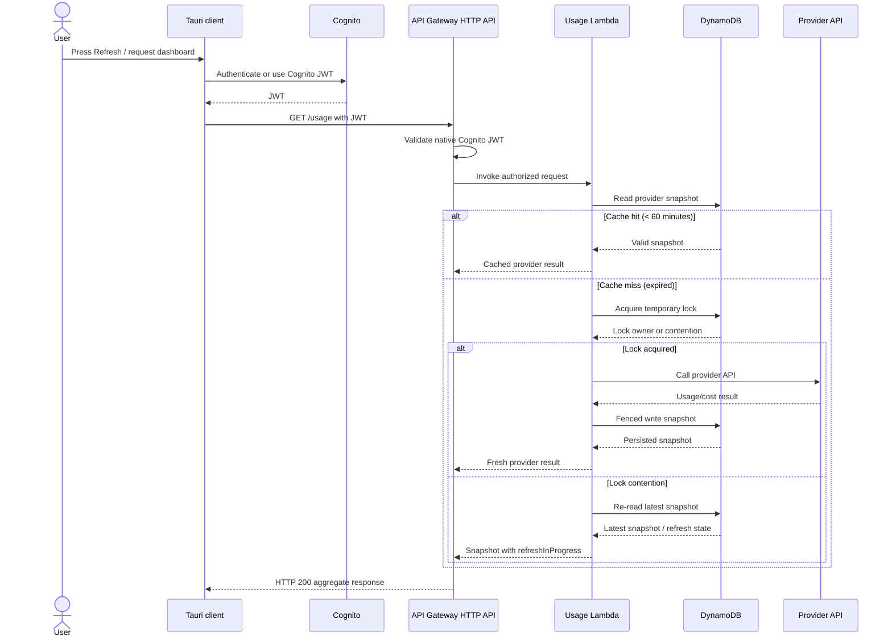

# Usage refresh flow

```mermaid
sequenceDiagram
    actor User
    participant Tauri as Tauri client
    participant Cognito
    participant API as API Gateway HTTP API
    participant Lambda as Usage Lambda
    participant DB as DynamoDB
    participant Provider as Provider API
    User->>Tauri: Press Refresh / request dashboard
    Tauri->>Cognito: Authenticate or use Cognito JWT
    Cognito-->>Tauri: JWT
    Tauri->>API: GET /usage with JWT
    API->>API: Validate native Cognito JWT
    API->>Lambda: Invoke authorized request
    Lambda->>DB: Read provider snapshot
    alt Cache hit (< 60 minutes)
        DB-->>Lambda: Valid snapshot
        Lambda-->>API: Cached provider result
    else Cache miss (expired)
        Lambda->>DB: Acquire temporary lock
        DB-->>Lambda: Lock owner or contention
        alt Lock acquired
            Lambda->>Provider: Call provider API
            Provider-->>Lambda: Usage/cost result
            Lambda->>DB: Fenced write snapshot
            DB-->>Lambda: Persisted snapshot
            Lambda-->>API: Fresh provider result
        else Lock contention
            Lambda->>DB: Re-read latest snapshot
            DB-->>Lambda: Latest snapshot / refresh state
            Lambda-->>API: Snapshot with refreshInProgress
        end
    end
    API-->>Tauri: HTTP 200 aggregate response
```
